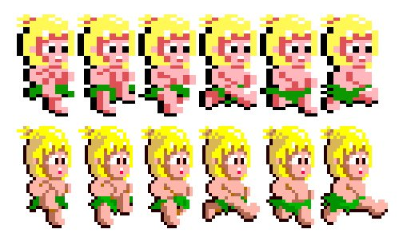

# Wonder-Boy
My implementation of the classic wonder boy arcade game

## Cover page
# Wonder Boy Project in Comprehensive Programming Course

_Jung Dae Kwon_

_Gaming Experience Development_

## Executive summary
> The adventurous young boy goes out on a long journey to chase the Evil King, who had kidnapped his girlfriend. Players should guide "Wonder Boy" through an island and rescue her.

> In this game, players encounter a dynamic and visually captivating arcade experience. The game features a diverse range of areas, each presenting unique challenges and enemies for Wonder Boy to overcome. 

## Game Description

_Overview_

- The Wonder Boy arcade game is a classic side-scrolling platformer that takes players on an exciting adventure. Players navigate through various levels filled with obstacles, enemies, and challenging terrain, embodying the mischievous young boy on a quest to rescue his kidnapped girlfriend from the clutches of the villainous King.

- When riding the skateboard, the gameplay in Wonder Boy undergoes a transition to a horizontal side-scrolling format. During this phase, players have the ability to accelerate and decelerate, introducing dynamic control over the character's speed.

- The main character begins the game without any weapons. However, after acquiring a weapon, the player can throw it towards enemies. It he loses a life, the character respawns without any equipment.

_Quest_

- The player's mission is to rescue the girlfriend, who has been kidnapped by Evil King. To achieve this, players must guide Wonder Boy through diverse landscapes, overcoming enemies and obstacles in each level. The journey is characterized by a mix of platforming elements, strategic gameplay, and the exploration of different areas, making the quest both challenging and rewarding.

_Main Character_

- A lively and determined young boy, he has a smiling face and cheerful eyes. Wearing a simple active outfit to combat immediately, he exhibits excellent athletic abilities, including high jumps and fast movements. The skateboard provides him with rapid mobility, serving as a special feature in the game. Filled with passion and courage, he adventures to rescue his girlfriend.

_Sketch of Main Character_

_Opponents_

| Enemy      | Description                                                                                                                                                                    |
|------------|--------------------------------------------------------------------------------------------------------------------------------------------------------------------------------|
| Snail      | The most frequently encountered enemy. Approaches very slowly.   |
| Hornet     | Moves vertically and approaches as an enemy. |
| Cobra      | Primarily found in cliff stages. Since they don't move, players can either avoid them or eliminate them. |
| Frog       | Jumps up when approached. Requires two stone axe hits to defeat. |
| Octopus    | Appears in sea stages. |
| Bat        | Found in cave stages. Clings to the ceiling and suddenly approaches when the player gets close. |
| Skeleton   | Doesn't move but burns upon contact, requiring players to either jump over or defeat them. |
| Native     | Primarily appears in sea stages. Approaches quite rapidly. |
| Spider     | Descends from above, moving downward.  |
| Goblin     | Extremely fast pursuer. Requires two stone axe hits to defeat. |
| Bluefish   | Only appears in sea stages. Moves vertically. |
| Rock       | Doesn't cause death upon contact but heavily depletes time, should jump over it. |
| Bonfire    | Instant death upon contact. Must be jumped over. Disappears along with the skateboard if riding one. |
| Icicle     | Exclusive to ice cave stages. Hangs from the ceiling and falls when the player gets close. |
| Boulder    | Rolls down hills, occasionally appearing in cave stages. Instant death upon contact; jump over them. Destruction is only possible with the angel equipped. |

_Sketch of Opponents_

_Envirnment_

>A vibrant and diverse world that seamlessly blends natural landscapes with fantasy elements.

>Forest Stage: The game typically begins in a lush forest setting, characterized by dense vegetation, trees, and vibrant colors. 

>Meadow Stage: Expansive meadows and open areas may be encountered, introducing different types of enemies and platform challenges. 

>Cliff Stage: This stage presents vertical challenges with cliffs, ledges, and elevated platforms. Precise jumping and timing are essential to avoid falling.

>Underwater/Sea Stage

>Cave Stage: Dark and mysterious caves featuring dimly lit passages and other underground elements. 

>Boss Stages: Players encounter powerful bosses that must be defeated to progress.

_Menus_

- Start
- High Scores
- Quit

_Controls_

| Action | Key |
| ------ | ------ |
| Right | Right arrow or D|
| Left  | Left arrow or A|
| Throw weapon | Space |
| Jump | Up arrow or W|
| Speed down | Same as Left (on Skate Board) |
| Speed up | Same as Right (on Skate Board) |
| Pause | P |
| Quit | Q |

_Sounds_

| Sounds | Description |
| ------ | ----------- |
| Background music | Cheerful melodiy and bright tone to create a positive and engaging atmosphere |
| On skateboard | Upbeat and fast-paced music with a quick tempo, creating a sense of speed and excitement as the character rides the skateboard |
| Thorwing weapon | Audible throwing sound effect when the player launches a weapon |
| Death | Failure sound with deducting lives |
| Game over | Short melody accompanied by a classic game over sound, signaling the end of the game after losing all lives |
| Collision | Collision beep sound with deducting heath bars |
| Calculating scores | Sound effect played during the computation of scores |
| Getting items | Beep sound accompanying the acquisition of beneficial items |
| Enemy death | Providing feedback on successful actions against enemies |

## Summary

Wonder Boy, a classic platformer, follows the adventures of main character navigates diverse landscapes. The game features stages such as lush forests, meadows, cliffs, underwater areas, caves, and challenging boss encounters.

## Key Points:

- **Main character:** A spirited character on a quest to rescue his girlfriend.
  
- **Stages:**
  1. Forest: Introduction to gameplay mechanics.
  2. Meadow: Open areas with new challenges.
  3. Cliff: Vertical challenges, precise jumping.
  4. Underwater/Sea
  5. Cave: Dark, mysterious caves with obstacles.
  6. Boss Stages: Combat with powerful bosses.

- **Environment:** A timeless blend of natural wonders and fantastical landscapes.

- Wonder Boy provides a nostalgic experience for players.

In Wonder Boy, players will have a classic pixel graphic journey, overcoming obstacles, and reliving the magic of classic platformers.
